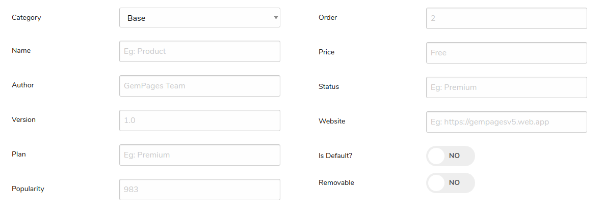
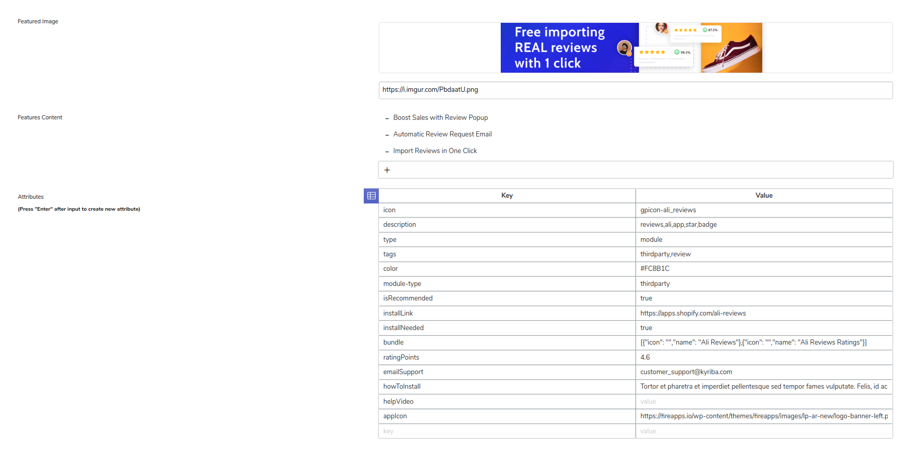
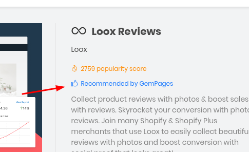
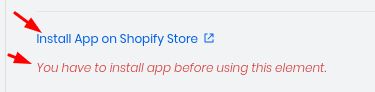
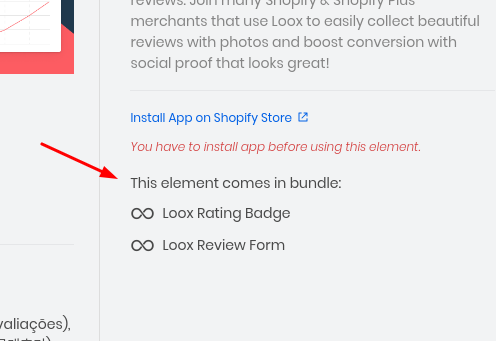
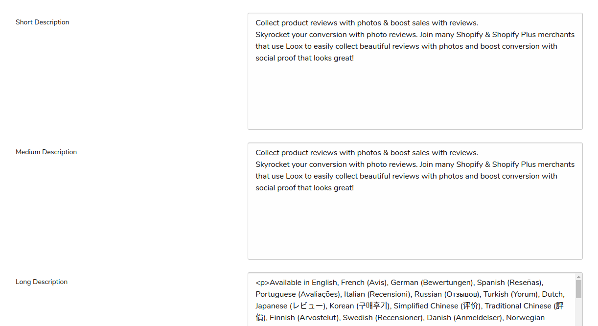
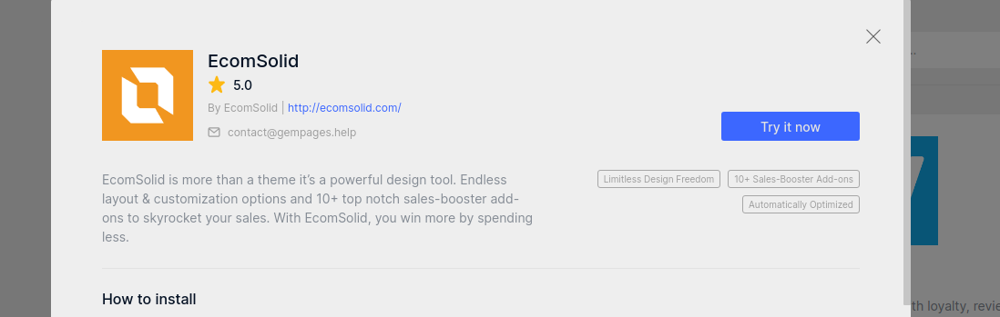
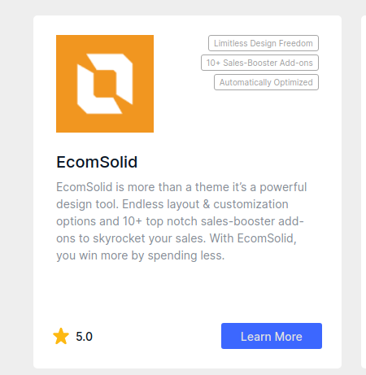
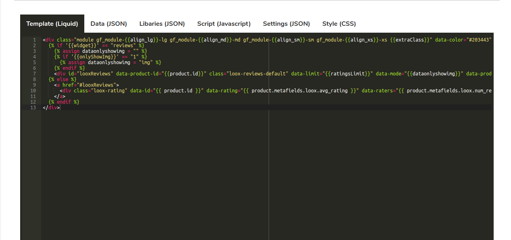

# Manage Snippets

## Ý nghĩa các trường trong 1 snippet

- **Category**: Loại Category mà Snippet đó thuộc về (Base, Module, Third Party,...)

- **Name**-: Tên của Snippet đấy

- **Author**: Tác giả của Snippet đấy (Eg: GemPages, AliReview, Loox,...)

- **Version**: Phiên bản hiện tại của Snippet đấy

- **Plan**: Plan mà Snippet đấy thuộc về (Eg: Starter, Professional, Advanced, Premium)

- **Popularity**: Số lượt cài đặt của Snippet này

- **Order**: Thứ tự của Snippet, dùng để sắp xếp độ ưu tiên của các snippets trong cùng 1 category

- **Price**: Giá của Snippet đấy

- **Status**: trạng thái của Snippet đấy (Eg: hide, hot, new,...)

- **Website**: nguồn của Snippet

- **Is Default?**: Những khách mới vào Editor sẽ được ưu tiên cài đặt sẵn những snippet đang enable option này

- **Removable**: Cho phép khách hàng xóa snippet này trong Library hay không. Default nên để Yes, đối với những Snippet base mới nên để No

- **Featured Image**: Ảnh banner của Snippet

- **Featured Content**: Một số tính năng chính của Snippet

- **Attributes**: Một số thuộc tính phụ của Snippet

  - **icon** (required): class icon của snippet, là gpicon trong Editor
  - **description** (required): các từ khóa chính liên quan snippet, dùng để dễ dàng cho việc search
  - **type** (required): loại snippet (Eg: module, element, row)
  - **tags**: dùng để phân loại trong Editor (Eg: ecommerce, review, thirdparty, design)
  - **color**: background màu để hiển thị icon, default của type module là màu xanh, để sử dụng màu khác thì dùng attribute này, ví dụ: #203443
  - **module-type**: chưa biết dùng để làm gì...
  - **isRecommended**: boolean value, phục vụ cho việc hiển thị cái này
    

  - **installLink**: link install app trên Shopify
  - **installNeeded**: có yêu cầu phải cài app Shopify hay không
    

  - **bundle**: mô tả những thứ có trong Snippet
    

  - **ratingPoints**: điểm Rating của app đấy trên Shopify
  - **emailSupport**: email support của Snippet đấy
  - **howToInstall**: Text mô tả how to install
  - **helpVideo**: chưa biết dùng để làm gì...
  - **appIcon**: đường dẫn đến ảnh logo của Snippet đấy
  - **iconType**: loại icon hiển thị, default là gpicon
  - **iconImage**: khi iconType là image thì thêm trường này để hiển thị ảnh thay vì icon

- **Short Description**: hiển thị ở những chỗ sau
  

  

- **Medium Description**: Mô tả trung bình

- **Long Description**: Mô tả dài

  

- **Template, Data, Libraries, Script, Settings, Style**: các phần của 1 Atom
