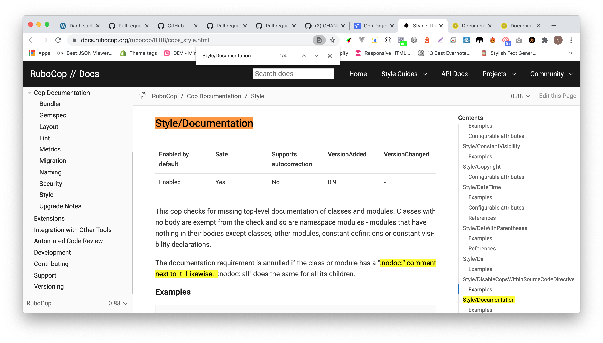

# Coding Convention

## Installation

Install Rubocop version 0.88.0

```ruby
gem install rubocop --version 0.88.0
```

Config in Gemfile (should be only for development and test environtment)

```ruby
gem 'rubocop', '~> 0.88.0', require: false
```

## Usage

Auto-correct all files in project:

```ruby
rubocop -a
```

Auto-correct specific file:

```ruby
rubocop -a app/services/page_service.rb
```

Auto-correct multiple files:

```ruby
rubocop -a app/services/page_service.rb app/services/shop_service.rb
rubocop -a app/*
```

## Configuration

The behavior of RuboCop can be controlled via the [.rubocop.yml](https://github.com/rubocop/rubocop/blob/master/.rubocop.yml) configuration file. It makes it possible to enable/disable certain cops (checks) and to alter their behavior if they accept any parameters.

You can check the configs list [here](https://docs.rubocop.org/rubocop/0.88/cops_bundler.html). Remember that GemPages always use version 0.88.0 for coding convention.

If you want to override defaut rubocop's config. Go to the link below then add your config in **.rubocop.yml** suck as:

If you want to require top document for each class. This rule is **Style/Documentation**. Search this rule in Style tab then see the configs.

See that. It have only **Enable** configscreen shot 2020-10-12 at 11.15.16 am.png



Now I want to disable this I wrote


Ok let try another config. I want to config indentation for my project. This rule is **Layout/IndentationStyle**. It have these configs.


I want to change my indentation from spaces to tabs I wrote


