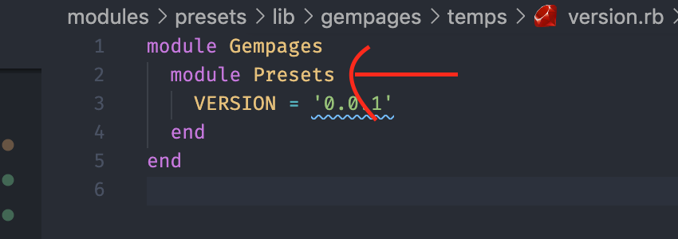

# Gempages Module

## How to create a GemPages module?

### Duplicate from simple module

You should duplicate the **temps** folder instead of typing **rails plugin new module_name** because this simple module have the gempages's structure. In this example I will create a module called **presets**

### Update files/folders and namespace to correct name

#### Update .gemspec file

#### Update the lib folder

> [!attention]
> Remember update the files/folders name, path and module namespace to your module's name.

#### Update the app folder

Update all the files/folders inside app to correct name.

> [!attention]
> Notice: all the files always wrapped by **gempages/module_name** folder.

**Eg**: controllers/gempages/presets/todos_controller.rb

> [!attention]
> Important Note:

> Controller have application_controller.rb which extends from core module Gempages::ApplicationController. That mean it will have Shopify & GemPages authentication.
>
> We have 3 types of controller:
>
> - public: Public API/Views which have no authentication
> - api: API/Views which have Shopify & GemPages authentication
> - open: API/Views which authenticate by token from gem-auth
>
> Remember delete all the useless folders that do not use in module. Eg: assets, test, mailers, views, etc
