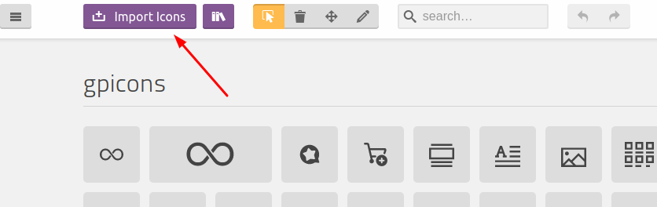
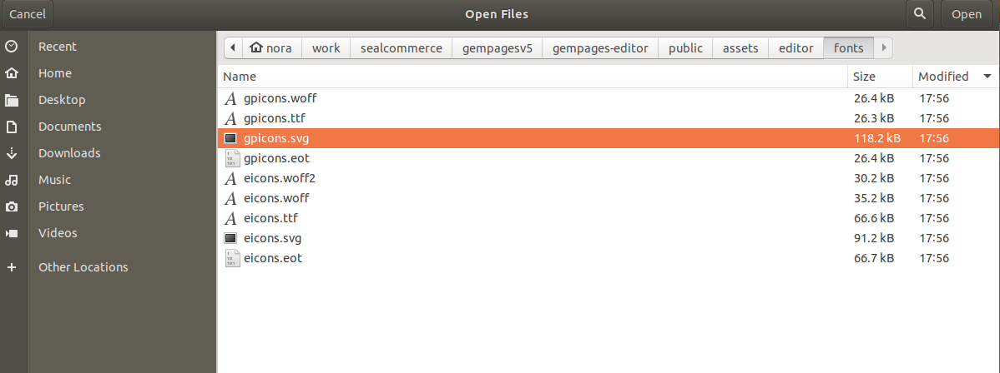
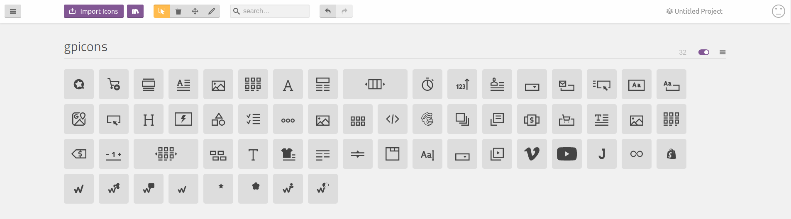
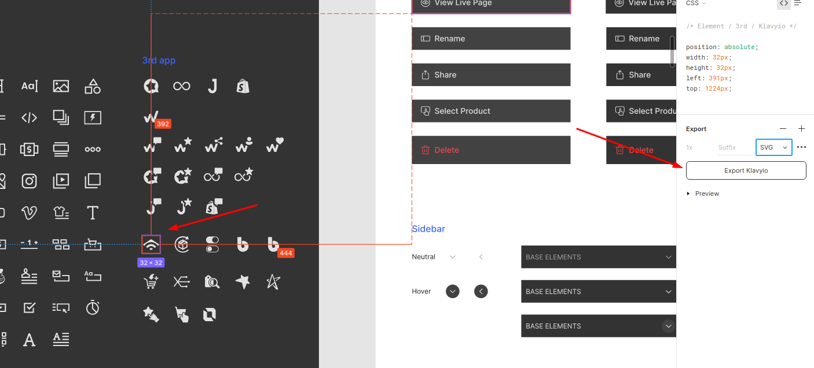
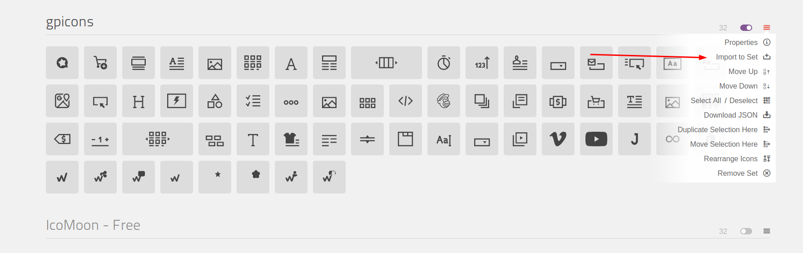
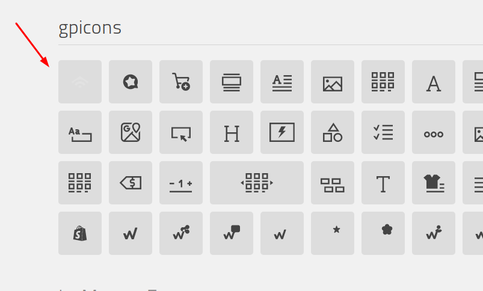
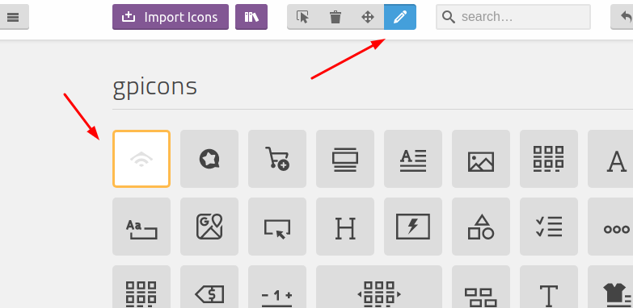
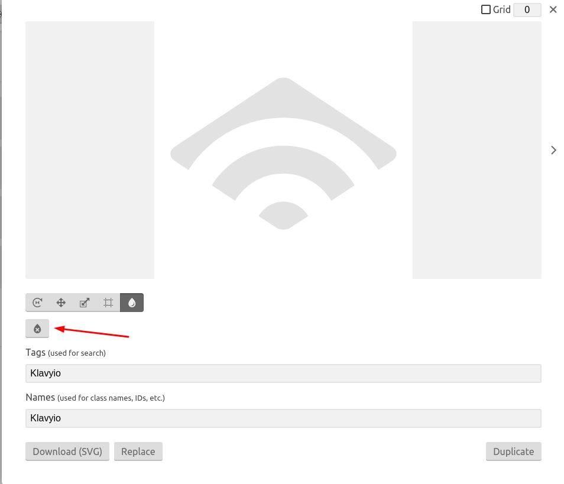
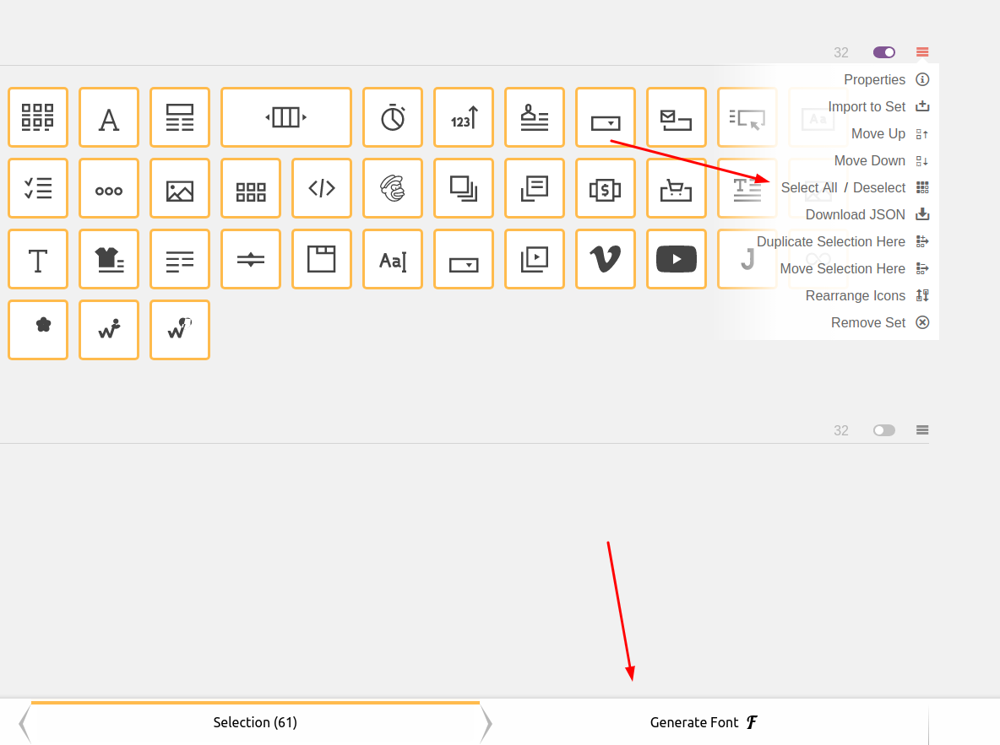

# How to generate Font Icons by using Icomoon

## Import & Edit Font Icon

1. Vào IcoMoon login tài khoản công ty (DM <nora@gempages.help> để lấy account):

2. Sau đấy vào IconMoon app, để import font icons hiện tại của Editor bầm vào phần Import Icons
   

3. Chọn file svg tương ứng trong source
   

4. Khi đấy giao diện sẽ như sau:
   

5. Để thêm mới 1 icon thì cần lên figma, export ra svg tương ứng
   

6. Sau đấy chọn **Import to set** và chọn file svg vừa export ra
   

7. Ta sẽ được như sau
   

8. Để sửa lại màu của icon thì cần chọn vào nút Edit xong chọn icon cần sửa
   

9. Sau đấy click vào nút remove color
   

## Export Font Icons

1. Để export chọn **Select All** và click vào **Generate Font** ở footer
   
