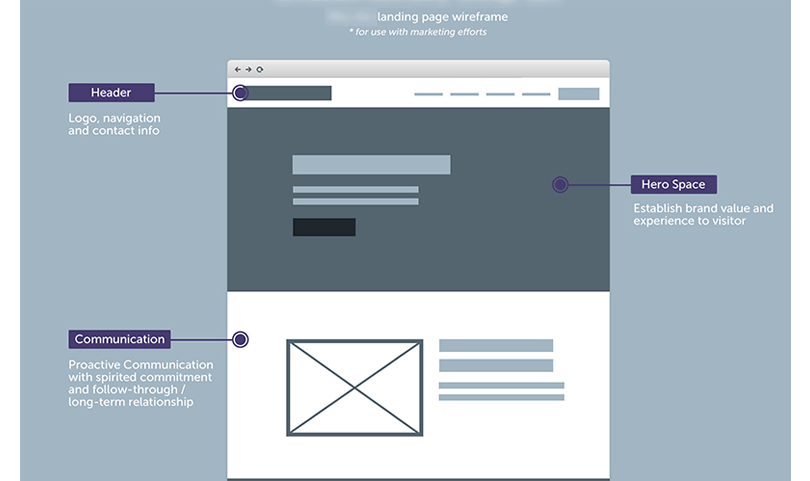

# Cấu trúc một Atom

## Giới thiệu

### Atom là gì?

> Atom là một class Core. được thiết kế để đảm nhận các nhiệm vụ: Render (Template, Style, Setting, Liquid, Atom Childs...) đảm bảo đối tượng được hiển thị đúng và đủ sau khi kéo ra site khách hàng

Một vài thành phần hỗ trợ cho Atom:

- Settings.ts
- Toolbar.ts
- Dragable.ts
- Outline.ts

### Tại sao tên là Atom?

Theo cách design website thế hệ mới thì người ta sử dụng các component để cấu tạo nên website. Component thì có thể là một Text, Button, Input nhưng cũng có thể là Hero Banner, Product...

Sự nhập nhằng đó làm cho component rất mạnh mẽ và dễ hiểu khi có thể kết hợp các component base như Text, Button, Image để tạo thành một component khách là Hero Banner.

Theo cấu trúc lập trình đó thì trong design cũng có khái niệm là: **Atomic Design**

Link tham khảo: [https://atomicdesign.bradfrost.com](https://atomicdesign.bradfrost.com)

Atom của GemPages được build dựa trên ý tưởng này để giúp khách hàng có thể lắp ghép thành website của họ từ những atom(nguyên tử) bé nhất.

Vậy nên, atom được lấy là tên gọi cho class Core với đúng mục đích của nó

## Cấu trúc một Atom

### Thành phần

Atom cơ bản thì gồm các thành phần như:

- Snippets: Định nghĩa settings
- Html: Định hình dáng hiển thị
- Style: Tạo hình dáng và màu sắc
- Script: Tạo các kịch bản hoạt động
- Libs: Chứa các thư viện hỗ trợ

### Phân loại

Trong chương trình của chúng ta phân loại Atom thành 3 loại chính

- Row
- Element
- Module

Ngoài ra chúng ta cũng có một số loại phụ khác như:

- Third party
- Liquid (Custom code)

## Tạo một Atom

### Tạo Html

### Tạo Style

### Tạo script

### Tạo Snippets(settings)

### Đăng ký các thuộc tính

1. type (row, element, module)
2. label
3. key (duy nhất mỗi atom)
4. settings
5. data
6. html
7. style
8. script
9. libs
10. version (di cùng với key để nâng cấp version)
11. main (dùng để update version)
12. platform
13. icon
14. cat
15. description
16. color
17. status
18. rules (dành cho validate kéo thả vào khu vực nào, kéo thả vào trang nào, phân nhóm, chức năng đặc biệt)

- Kéo thả khu vực
- Kéo thả trang
- Phân nhóm
- Chức năng đặc biệt
  - thirdparty
  - liquid

19. plans ("start,pro")
    Những lưu ý cần thiết
