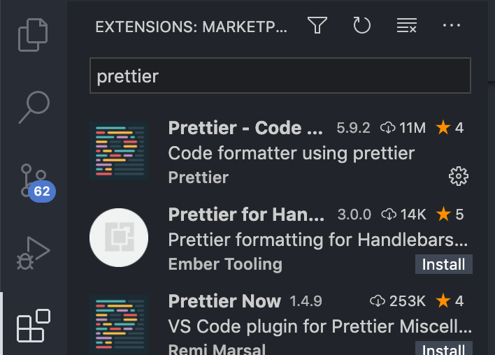
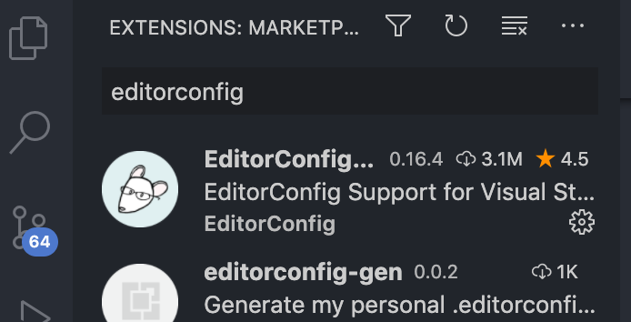
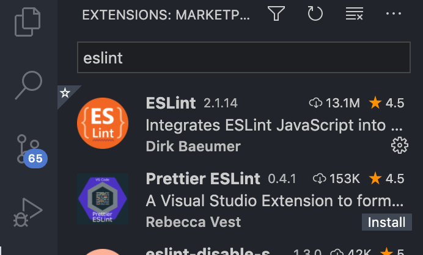
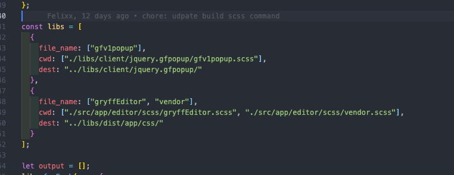
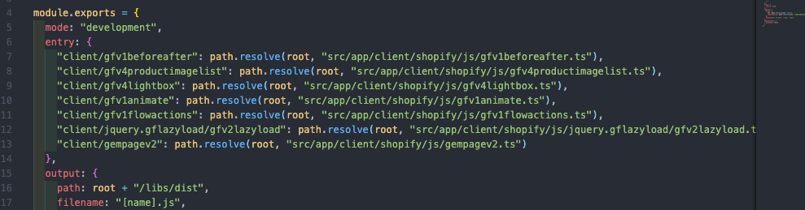

# Setup environment

## Quy chuẩn code

**Các vấn đề gặp phải khi làm việc nhóm:**

1. Code không quy chuẩn
2. Mỗi người có một style riêng
3. Có những lỗi vặt liên quan đến cú pháp của từng cá nhân
4. Việc commit git gặp khó khăn, hay conflict

**Với tất cả các vấn đề trên thì việc kết hợp các chuẩn có sẵn của thế giới để giúp các thành viên code giống nhau hơn là một điều cần thiết.**

1. ESlint là một quy chuẩn chung giúp team làm việc tốt hơn, tránh những lỗi sai cơ bản trong code.
2. Beautify thì nó sẽ là một quy chuẩn về phong cách style
3. EditorConfig giúp tự động format những quy tắc nhỏ

## Cài đặt Vscode

Link: [https://code.visualstudio.com](https://code.visualstudio.com)

### Prettier

Bạn chỉ cài cài theo đường dẫn sau:

[https://marketplace.visualstudio.com/items?itemName=esbenp.prettier-vscode](https://marketplace.visualstudio.com/items?itemName=esbenp.prettier-vscode)

Hoặc có thể vào VSCode rồi tìm kiếm Prettier sẽ ra extension có hình như sau:


### EditorConfig

Bạn chỉ cài cài theo đường dẫn sau:
[https://marketplace.visualstudio.com/items?itemName=EditorConfig.EditorConfig](https://marketplace.visualstudio.com/items?itemName=EditorConfig.EditorConfig)

Hoặc có thể vào VSCode rồi tìm kiếm EditorConfig sẽ ra extension có hình như sau:



### ESLint

Bạn chỉ cài cài theo đường dẫn sau:

[https://marketplace.visualstudio.com/items?itemName=dbaeumer.vscode-eslint](https://marketplace.visualstudio.com/items?itemName=dbaeumer.vscode-eslint)

Hoặc có thể vào VSCode rồi tìm kiếm ESLint sẽ ra extension có hình như sau:



## Run code

### Clone thư mục code

Bạn sẽ quy cập vào repo của Editor trên github và clone về máy

### Cài đặt thư viện

#### Bước 1: Cài đặt **yarn** vào máy:

Nếu bạn chưa có yarn thì cần cài yarn trước:

```bash
npm install -g yarn
```

#### Bước 2: Cài đặt thư viện:

```bash
yarn install
```

## Các script hỗ trợ

### lint

Chạy lint giúp tìm ra các vấn đề trong code đang lỗi hoặc cảnh báo:

```bash
yarn lint
```

### Serve

Script này giúp chạy editor + build scss client + build js client ở chế độ DEV

```bash
yarn serve
```

### Build

Script này giúp build editor + scss client + js client ở chế độ production

```bash
yarn build
```

### Serve scss client

Giúp build code scss ra css. Code này sẽ dùng ngoài live store của khách hàng:

```bash
yarn serve:client:scss
```

### Serve client

Giúp build code js của client. js này sẽ được sử dụng ngoài live store của khách hàng

```bash
yarn serve:client
```

### Serve editor

Script này giúp khởi động editor ở chế độ DEV

```bash
yarn serve:editor
```

## Thêm code ngoài client

### Build SCSS to CSS client như nào

Bạn quy cập file theo đường dẫn:

```path
webpack/webpack.scss.config.js
```

Ở đó bạn sẽ thấy giao diện như này:



Bạn cần thêm một object vào biến libs với dữ liệu tương ứng là chương trình sẽ build file scss sang css tương ứng.

Các tham số:

- **file_name**: tên file css bạn muốn build ra
- **cwd**: đường dẫn đến file scss muốn build
- **dest**: thư mục chứa file sau khi build từ scss sang css
  > [!note]
  > **file_name** và **cwd** có thể nhận vào 1 array string để build ra tương ứng

### Build TS sang JS cho client như nào

Bạn vào theo đường dẫn sau:

```path
webpack/webpack.config.js
```

Bạn sẽ thấy như sau:



Bạn chỉ cần thêm một entry theo đường dẫn mong muốn:

Bên trái là thư mục được build ra
Bên phải là thư mục gốc chứa code typescript
