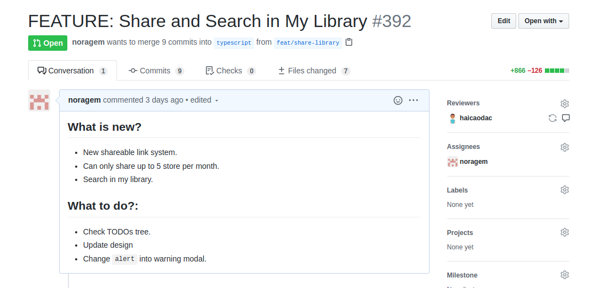

# Git Convention

## Commit Message

Khi commit cần chỉ rõ commit đấy làm gì và có chức năng gì

Cấu trúc chung của 1 commit message có dạng như sau:

```text
<type>[optional scope]: <description>
[optional body]
[optional footer]
```

Trong đó:

- **type** và **description** là thành phần bắt buộc cần có trong commit message, **optional scope** là tùy chọn, có cũng được không có cũng không sao.
- **type** là từ khóa để phân biệt loại commit như feat, fix, refactor,... kèm sau luôn phải có dấu ":"
- **scope** cũng dùng để phân loại message nhưng thường để trả lời câu hỏi ví dụ như:

  ```text
  fix(parser): parse Liquid error when render editor ​
  ```

- **body** mô tả dài và chi tiết hơn commit nếu description không đủ để mô tả hết
- **footer** một số thông tin mở rộng ví dụ như liên quan đến issue nào, pull request nào,...

## Một số type phổ biến khi commit

1. Commit dành cho 1 tính năng mới

   ```text
   feat: new element before & after image
   ```

2. Commit khi sửa lỗi

   ```text
   fix: validate background input field​
   ```

3. Commit khi sửa code nhưng không có tính năng mới, không có sửa lỗi, thay đổi về mặt code nhưng không thay đổi về mặt login, luồng thực thi

   ```text
   refactor: rename variable​
   ```

4. Sửa đổi nhỏ nhặt không ảnh hưởng nhiều

   ```text
   chore: change color spinner
   ```

5. Code cải thiện về mặt hiệu năng

   ```text
   perf: load editor and sidebar parallel​
   ```

## Branch Naming Convention

Tương tự với việc commit message cho đúng quy chuẩn thì đặt tên branch khi code cũng vậy.

Một số type hay dùng là feat, hotfix, refactor,...

1. Khi release 1 tính năng mới:

   ```text
   feat/new-element-before-after​
   ```

2. Khi sửa lỗi:

   ```text
   fix/prevent-click-button​
   ```

3. Khi sửa những lỗi nguy hiểm cần cập nhật luôn:

   ```text
   hotfix/editor-can-not-publish-page​
   ```

4. Thay đổi về mặt code như tối ưu, optimize code, cập nhật logic

   ```text
   refactor/optimize-save-page-performance​
   ```

## Pull Request Description

Khi tạo pull request cần mô tả rõ pull request đấy có nhiệm vụ gì, thay đổi gì, có phụ thuộc gì vào những pull request/issues khác hay không.
Khi đó chúng ta có 1 số quy định chung khi cập nhật description như sau:

Có 4 phần chính trong đó:

1. What is new?

   Phần này cần mô tả rõ pull request có những cập nhật gì mới. Ví dụ như tính năng mới, fix bug liên quan đến gì, support thêm các 3rd apps nào,..

2. What are changes? (optional)

   Khi trong pull request có nhiều files thay đổi mà không cần thiết phải review (ví dụ như file build) thì cần chỉ rõ ra file nào thay đổi quan trọng, cần review kĩ file nào,..

3. Tests passed (optional)

   Khi 1 tính năng mới thì nên có thêm các case đã test passed để người review xem có còn thiếu test case nào hay không.

4. What to do? (optional)

   Những việc cần làm khi merge pull request này, ví dụ như cần merge pull bên repo khác, cập nhật code bên admin,...

Ví dụ 1 pull request:



## Pull request template:

```markdown
## What is new?

- Rewrite (P) Price logic completely.
- Auto update price by quantity when changing variant.
- Support all money formats in Shopify.
- Support Best Currency Converter, even when changing variant, quantity, currency.
- Minor input width setting of (P) Quantity.

## What are changes? (optional)

- gfV3Product.js (serious review needed).
- allSnippets2.html (in (P) Price module and gryff-data).
- writeStyle.js

## Tests passed (optional)

- Show correct price, compare price.
- Update price, compare price when changing variant.
- Update price, compare price when changing quantity.
- Show correct format on Shopify dashboard setting.
- Function correctly when having Best Currency Formatter enabled.
- All (P) Quantity settings work correctly.

## What to do? (optional)

- Merge this branch to master
- Update changes in Snippet Dashboard
- Update gryff-data in server repo.
```
